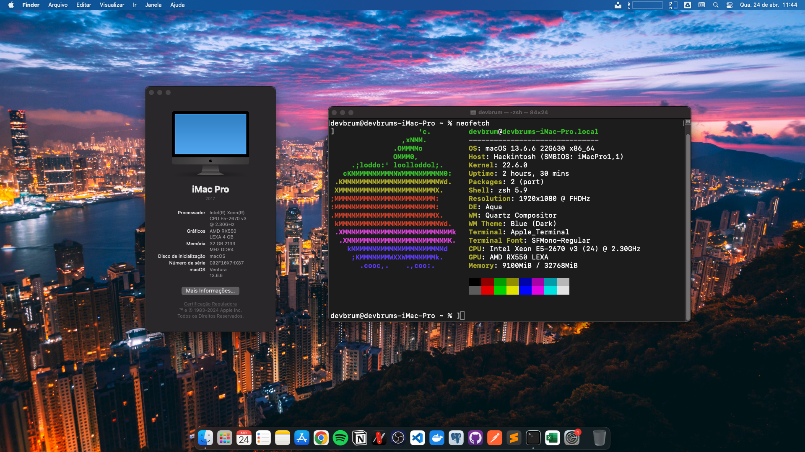

# Hackintosh EFI Setup Repository - X99

### Description
Welcome to the **Hackintosh EFI Setup Repository**! This project aims to streamline the process of setting up a Hackintosh by providing a pre-configured EFI folder tailored to specific computer configurations. The EFI folder includes all the necessary drivers and kexts, ensuring smooth compatibility with your hardware.

### Features
- **Updated OpenCore:** The EFI folder is equipped with the latest version of OpenCore, ensuring stability and compatibility with macOS.
- **Customized Drivers and Kexts:** Carefully selected drivers and kexts are included, optimized for your specific computer setup, minimizing the need for manual tweaking.
- **Essential Software:** Alongside the EFI folder, essential software tools required for data manipulation and system management are provided, simplifying the setup process further.

### How to Use
1. Download the EFI folder corresponding to your hardware configuration.
2. Replace the existing EFI folder in your macOS installation USB drive or EFI partition with the downloaded folder.
3. Boot into the macOS installer or existing installation using the modified EFI folder.
4. Follow the standard macOS installation process or boot into your existing macOS installation.

### Contribution
Contributions and feedback are welcome! If you have improvements or updates to the EFI setup, feel free to submit pull requests or raise issues.

### Disclaimer
Please note that the use of this repository and the provided EFI setups may involve legal and technical risks. Ensure that you have the necessary permissions and understanding of Hackintoshing before proceeding. The maintainers of this repository are not liable for any damages or legal implications resulting from the use of the provided configurations.

### Happy Hackintoshing!
We hope this repository simplifies your Hackintosh setup process, allowing you to enjoy macOS on your custom hardware configuration hassle-free. If you have any questions or need assistance, don't hesitate to reach out to the community for support.

## What didn't work?
- [x] Auxiliary monitor.
- [x] Bluetooth dongle TPLINK UB500
- [x] Two editions - *Release* and *Debug* Edition.
- [x] Updated montly with refresh versions of Opencore.

## My Configuration

Component|Description
:----|:----
[Mobo]|Machinist RS9
[CPU]|Intel Core Xeon E5-2670 v3, 2566mhz x99 Haswell-EP | 4th gen
[GPU]|AMD Radeon RX 550 4GB LEXA
[RAM]|Atermiter 32GB 2400mhz
[Chipset]|Q87
[Ethernet]|Realtek RTL8168/8111 PCI-E Gigabit Ethernet Adapter PHY: Realtek RTL8111/8212
[Audio]|Realtek ALC897 - Layout 66
[Storage]|KINGSTON SA400S37240G (50026B7784ED3D83)

